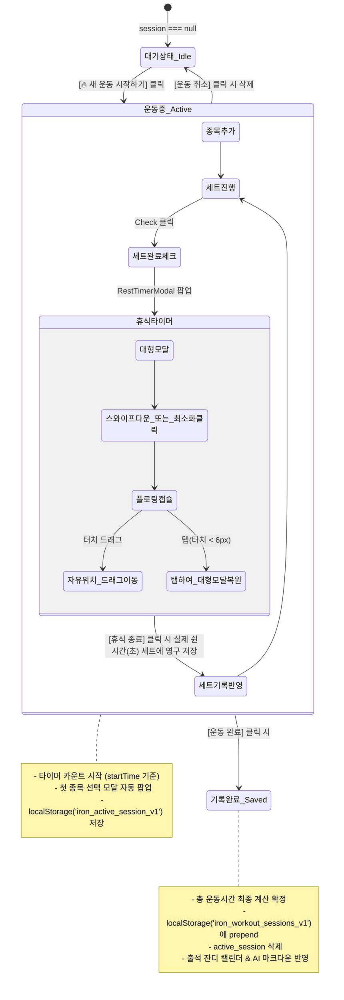

# 🏋️‍♂️ Iron Muscle Tracker (아이언 머슬 트래커) — 개발 종합 인수인계 가이드

> **이 문서는 다른 AI 에이전트나 개발자가 이 프로젝트의 아키텍처, 데이터 모델, 상태 흐름, 모바일 특화 예외 처리 및 히스토리를 즉시 파악하고 이어서 개발할 수 있도록 정리된 기술 명세서입니다.**

---

## 1. 프로젝트 개요 및 핵심 철학

- **프로젝트 명**: Iron Muscle Tracker (아이언 머슬 트래커)
- **최신 버전**: v3.7.2 (Android 영구 릴리즈 서명키 연동 및 마크다운 일지 가져오기/복원 지원)
- **핵심 철학**:
  1. **100% 로컬 독립형 (Offline-First & Local Privacy)**: 외부 백엔드 서버나 클라우드 DB 없이, 모든 운동 기록과 설정이 사용자의 기기 내부(`localStorage`)에만 저장됩니다.
  2. **생체역학 기반 전문성**: 880개 이상의 표준 운동 데이터베이스와 실물 운동 사진, 3D 근육 뷰어, RPE 기반 과부하 추적을 제공합니다.
  3. **Apple 감성 피트니스 UX**: 불필요한 입력을 최소화하고, 듀얼 스마트 타이머, 슈퍼세트 브래킷 연결, GitHub 잔디 스타일 출석 캘린더 히트맵을 제공합니다.
  4. **AI 코칭 친화적**: 운동 기록을 정밀한 구조화 마크다운(`.md`)으로 원터치 추출하여 ChatGPT, Claude 등 LLM에 붙여넣어 즉시 피드백을 받을 수 있습니다.

---

## 2. 기술 스택 (Tech Stack)

| 구분 | 기술 / 라이브러리 | 버전 / 비고 |
|---|---|---|
| **Core Framework** | React | `^18.2.0` (Hooks, Functional Components) |
| **Language** | TypeScript | `^5.2.2` (Strict Mode) |
| **Bundler & Tooling** | Vite | `^4.5.3` (`@vitejs/plugin-react`) |
| **Styling** | Tailwind CSS, PostCSS | `^3.4.0` (Apple Human Interface 스타일 다크/라이트) |
| **3D Graphics** | Three.js | `^0.160.0` (3D 인체 및 근육 부위 시각화) |
| **Mobile Runtime** | Capacitor | `@capacitor/core`, `android`, `ios` `^5.7.0` |
| **Haptics & Status** | Capacitor Plugins | `@capacitor/haptics`, `@capacitor/status-bar` `^5.0.6` |
| **Icons** | Lucide React | `^0.263.1` |

---

## 3. 디렉토리 구조 (Directory Structure)

```plaintext
iron-muscle/
├── android/                    # Capacitor Android 네이티브 프로젝트 (Gradle, Java)
├── ios/                        # Capacitor iOS 네이티브 프로젝트 (Xcode, Swift)
├── public/                     # 정적 웹 에셋 (favicon, 아이콘 등)
├── scripts/                    # 운동 DB 추출 및 데이터 가공 파이썬 스크립트
│   ├── build_db.py             # free-exercise-db 기반 번역 및 한국어 매핑 스크립트
│   └── add_more_machines.py    # 한국 헬스장 인기 머신 데이터 추가 스크립트
├── src/
│   ├── components/
│   │   ├── 3d/                 # Three.js 3D 인체/근육 뷰어
│   │   │   ├── HumanMuscle3DViewer.tsx
│   │   │   └── AnatomyDualViewer.tsx
│   │   ├── common/             # 공통 UI 컴포넌트
│   │   │   ├── Header.tsx      # 총 운동시간 시계, 다크모드 스위처, 탭 헤더
│   │   │   └── TabNavigation.tsx # 하단 3단 탭 네비게이션
│   │   ├── history/            # 운동 기록 조회 및 통계
│   │   │   ├── WorkoutHistoryView.tsx # 일간/월간/연간 기록, 잔디 캘린더, AI 마크다운 추출
│   │   │   ├── HistoryDashboard.tsx   # 볼륨/빈도/부위별 분석 대시보드
│   │   │   └── EditSessionModal.tsx   # 과거 운동 일지 수정 모달
│   │   └── workout/            # 핵심 운동 진행 및 기록
│   │       ├── WorkoutLogger.tsx       # 운동 세션 생성, 종목/세트 관리 및 완료
│   │       ├── ExerciseCard.tsx        # 종목별 카드, 머신 브랜드/세팅, 3D 뷰어
│   │       ├── SetRow.tsx              # 세트별 무게/횟수/RPE/템포/휴식 입력행
│   │       ├── RestTimerModal.tsx      # 세트 휴식 타이머 (스와이프 최소화, 드래그 캡슐)
│   │       ├── AddExerciseModal.tsx    # 초성 검색 및 종목 라이브러리 모달
│   │       ├── CreateCustomExerciseModal.tsx # 사용자 정의 커스텀 운동 직접 등록 모달
│   │       ├── ExerciseGroupModal.tsx  # 슈퍼세트/컴파운드세트 묶기 모달
│   │       ├── RpeGuideModal.tsx       # RPE 자각도 가이드 모달
│   │       └── SessionNotesModal.tsx   # 세션 총평 및 메모 모달
│   ├── data/
│   │   ├── exercises.ts        # 880+ 전문 운동 데이터베이스 (1.6MB)
│   │   ├── muscleMap.ts        # 17개 근육 타겟 한국어 명칭 및 매핑 테이블
│   │   └── sampleHistory.ts    # 신규 사용자를 위한 샘플 데이터
│   ├── types/
│   │   └── workout.ts          # 세션, 세트, 운동, 장비, 단위, RPE 등 핵심 타입 정의
│   ├── utils/
│   │   ├── audio.ts            # Web Audio API 기반 비프음/완료음 합성 매니저
│   │   ├── calculations.ts     # 1RM 추정식, 볼륨/반복수 집계, 단위 환산
│   │   ├── exerciseResolver.ts # ID 오타/레거시 복구 및 커스텀 운동 안전 리졸버
│   │   └── storage.ts          # LocalStorage CRUD 및 세션 이벤트 동기화
│   ├── App.tsx                 # 루트 컴포넌트, 전역 타이머, WebView 제스처 제어
│   ├── main.tsx                # React DOM 렌더 진입점
│   └── index.css               # Tailwind CSS 및 모바일 WebView 최적화 스타일
├── capacitor.config.ts         # Capacitor 앱 ID, 웹 디렉토리 및 플러그인 설정
├── package.json
├── tailwind.config.js
└── tsconfig.json
```

---

## 4. 데이터 모델 및 로컬 스토리지 명세

### LocalStorage 키 목록 (`src/utils/storage.ts`)

| 키 (Key) | 설명 | 데이터 형태 |
|---|---|---|
| `iron_workout_sessions_v1` | 완료되어 영구 보관된 운동 기록 일지 목록 | `WorkoutSession[]` |
| `iron_active_session_v1` | 현재 진행 중인 미완료 운동 세션 | `WorkoutSession \| null` |
| `iron_custom_exercises_v1` | 사용자가 직접 등록한 커스텀 운동 목록 | `Exercise[]` |
| `iron_theme_dark` | 다크 테마 활성화 여부 | `boolean` (기본값: 라이트 모드) |
| `iron_weight_unit` | 기본 무게 단위 (`kg` 또는 `lbs`) | `'kg' \| 'lbs'` |

### 핵심 인터페이스 요약 (`src/types/workout.ts`)

```typescript
// 단일 세트
export interface WorkoutSet {
  id: string;
  setNumber: number;
  weight: number;               // 중량 (kg 또는 lbs)
  reps: number;                 // 반복 횟수
  completed: boolean;           // 세트 완료 여부
  rpe?: number;                 // 운동 자각도 (6.0 ~ 10.0)
  tempo?: { eccentric: number; pause: number; concentric: number }; // 템포(초)
  restSeconds?: number;         // 해당 세트 후 실제로 소요된 휴식 시간(초)
  side?: 'left' | 'right' | 'both'; // 편측(원암/원레그) 기록
  comment?: string;
  tags?: string[];              // '탑세트', '백오프', '드롭세트' 등
}

// 운동 종목 아이템
export interface WorkoutExercise {
  id: string;
  exerciseId: string;           // exercises.ts 또는 custom id 참조
  equipmentType: EquipmentType; // 'machine' | 'barbell' | 'dumbbell' | 'cable' | 'bodyweight'
  machineBrand?: string;        // 'NewTech', 'Hammer Strength' 등
  machineSetting?: string;      // '의자 4단, 발판 중간' 등
  loadType?: 'plate-loaded' | 'pin-loaded'; // 원판 or 핀머신
  executionMode?: 'bilateral' | 'unilateral'; // 투암 or 원암
  groupId?: string;             // 슈퍼세트 그룹 ID
  groupLabel?: string;          // '슈퍼세트 A-1' 등
  sets: WorkoutSet[];
  weightUnit?: WeightUnit;      // 종목별 독립 단위 지원
}

// 전체 운동 세션
export interface WorkoutSession {
  id: string;
  title: string;                // 예: '가슴 & 삼두 루틴'
  date: string;                 // 'YYYY-MM-DD'
  startTime: string;            // ISOString
  endTime?: string;             // ISOString
  durationSeconds: number;      // 총 순수 운동 시간(초)
  exercises: WorkoutExercise[];
  completed: boolean;
  weightUnit: WeightUnit;
  conditionEmoji?: string;      // 🔥(100%), 💪(80%), ⚡(60%), 🥱(40%), 🩹
  isDeload?: boolean;           // 디로딩 여부
  notes?: string;               // 전체 메모/일기
  overallRpe?: number;
  targetCategories: Category[];
  targetPartIds: string[];
}
```

---

## 5. 운동 세션 라이프사이클 및 상태 흐름



---

## 6. 모바일 웹뷰(Capacitor/WebKit/Chromium) 특화 처리 내역

모바일 기기에서 웹 앱 구동 시 발생하는 고질적인 문제들을 다음 구현으로 완벽히 해결했습니다:

1. **안드로이드 물방울 커서 및 시스템 팝업 차단 ([`src/index.css`](file:///Users/minseong/study/iron-muscle/src/index.css), [`src/App.tsx`](file:///Users/minseong/study/iron-muscle/src/App.tsx))**:
   - `user-select: none !important;` 및 `-webkit-touch-callout: none !important;` 적용.
   - 단, 메모/노트/자유 텍스트 입력창은 복사/붙여넣기가 가능하도록 복원.
   - 숫자 입력 후 안드로이드 컴포지터가 오버레이 핸들 비트맵을 화면에 남기는 버그를 막기 위해 일시적 `disabled` 리페인트 트릭 적용.
2. **안드로이드 네이티브 `<select>` 텍스트 투명 버그 해결**:
   - 안드로이드 WebView에서 `<select>` 터치 시 뜨는 단일 선택 라디오 다이얼로그(흰색 배경)에서 텍스트가 흰색으로 증발하던 버그를 해결하기 위해 `select option { color: #111111 !important; background-color: #FFFFFF !important; }`를 강제 지정.
3. **백그라운드 전환 시 타이머 정지 방지**:
   - 안드로이드/iOS 백그라운드 전환 시 `setInterval`이 throttle/pause 되는 문제를 해결하기 위해 틱 횟수가 아닌 `Date.now() - lastTick` 실제 경과 시간을 합산하여 1초의 오차도 없도록 보정.
4. **모바일 마크다운 다운로드 호환 (Web Share API)**:
   - iOS Safari 및 Android WebView에서 `blob:` 다운로드 링크가 차단되는 문제를 해결하기 위해 `navigator.share({ files: [file] })`를 1순위로 지원.
   - 동시에 `navigator.clipboard.writeText`를 자동 병행하여 클립보드에 100% 보존.

---

## 7. 최근 해결된 주요 피드백 및 기능 추가 히스토리

### 피드백 1: 세트 타이머 제스처 최소화 & 드래그 플로팅 캡슐
- **구현**:
  - `RestTimerModal.tsx`에 터치 제스처(`onTouchStart`, `onTouchMove`, `onTouchEnd`) 리스너를 장착하여 아래로 70px 이상 쓸어내리면 부드럽게 최소화.
  - 상단에 iOS 스타일의 풀다운 손잡이 바(Grab handle) 배치.
  - 최소화 상태에서 화면을 가리던 기존 가로 전체 고정 바를 제거하고, 화면 어디든 손가락으로 끌고 다닐 수 있는 컴팩트 플로팅 캡슐 위젯으로 재설계.
  - 화면 밖 이탈 방지(Clamping) 및 탭(복원) vs 드래그(이동) 구분 처리.

### 피드백 2: 세트 타이머 작동 중 선택창 값 날아감 & 텍스트 실종
- **구현**:
  - 안드로이드 WebView의 `<select>`/`<option>`에 명시적 텍스트/배경 컬러 강제 지정으로 투명 라디오 다이얼로그 버그 원천 해결.
  - `saveActiveSession` 및 세션 이벤트 발생 시 기존에 더 많이 누적된 타이머 초수와 입력 상태가 덮어써지지 않도록 방어 로직 적용.

### 피드백 3: 신규 머신 종목 추가 및 커스텀 운동 직접 등록
- **구현**:
  - `exercises.ts` 최상단에 요청 종목 3종 공식 탑재:
    1. **V-스쿼트 (V-Squat Machine)**: 하체 / 머신 / 대퇴사두근·둔근
    2. **바이킹 프레스 (Viking Press Machine)**: 어깨 / 머신 / 전면·측면 삼각근
    3. **스탠딩 레터럴 레이즈 머신 (Standing Lateral Raise Machine)**: 어깨 / 머신 / 측면 삼각근
  - **새 운동 직접 등록 시스템 (`CreateCustomExerciseModal.tsx`)**:
    - 종목명, 영문명, 부위, 장비(머신/바벨/덤벨/케이블/맨몸), 부하방식(원판/핀), 주동근 선택 폼 지원.
    - `iron_custom_exercises_v1`에 영구 보존되며 라이브러리에 `[★커스텀]` 배지와 함께 즉시 노출 및 선택 가능.
    - 검색 결과가 없을 때도 `['검색어' 직접 등록하기]` 원터치 버튼 연동.

### 피드백 4: 총 운동 시간이 1분대에서 리셋되는 치명적 버그 원천 해결
- **원인 분석**:
  - 사용자가 약 1분 후 1세트를 마치고 세트 값을 수정하거나 체크할 때 `WorkoutLogger`의 `handleUpdateExercise`가 호출됨.
  - 이때 `WorkoutLogger`의 리액트 상태 `session`에 들어있던 시작 당시의 `durationSeconds: 0`으로 로컬스토리지와 전역 이벤트를 덮어써버려 `App.tsx`의 타이머가 0초로 강제 리셋되던 문제.
- **해결**:
  - `storage.ts`의 `saveActiveSession`에서 기존 누적 `durationSeconds`가 더 클 경우 보존하도록 1차 방어.
  - `WorkoutLogger.tsx`에서 모든 세션 업데이트 및 세트 체크 시 `getLatestDuration()`(로컬스토리지, 현재 상태, `startTime` 기준 실제 경과 시간 중 최대값)을 동기화하여 덮어쓰기 원천 차단.
  - `handleCompleteWorkout` 시점에 최종 총 운동 시간을 확정하여 히스토리와 완료 알림에 기록.
  - `App.tsx`의 세션 변경 리스너에서도 `Math.max(prev, current.durationSeconds)`로 안전 보존.

### 피드백 5: 마크다운 파일 다운로드 및 파일명 포맷 변경
- **구현**:
  - 파일명 포맷을 사용자 요구에 맞추어 `_YYYYMMDD.md` (예: `_20260909.md`)로 변경.
  - 모바일 Web Share API 지원으로 아이폰 '파일에 저장' 및 안드로이드 시스템 다운로드 시트 연결.
  - 다운로드 시 클립보드 복사 병행으로 AI 활용성 극대화.

### v3.7.2 추가 개선 사항

#### 1. Android 영구 릴리즈 서명키 연동 및 무중단 덮어쓰기 업데이트
- **문제점**: 이전 CI 빌드에서는 매번 새 GitHub runner의 임시 디버그 키로 빌드되어 서명이 달라져, 기존 설치된 앱 위에 덮어쓰기 업데이트가 불가능하고 앱 삭제 재설치 시 로컬스토리지 운동 데이터가 유실되는 위험이 있었음.
- **해결**:
  - `iron-muscle-release.jks` 영구 릴리즈 서명키 생성 및 GitHub Actions Secrets(`ANDROID_KEYSTORE_BASE64`, `ANDROID_KEYSTORE_PASSWORD`, `ANDROID_KEY_ALIAS`, `ANDROID_KEY_PASSWORD`) 연동.
  - CI 워크플로에서 일관된 릴리즈 서명 및 단조 증가하는 `ANDROID_VERSION_CODE`로 `assembleRelease` 빌드를 수행하여, 데이터 유실 없는 원활한 앱 덮어쓰기 업데이트 환경 구축.

#### 2. 마크다운(.md) 운동 일지 직접 복원 및 가져오기 엔진 구현
- **문제점**: 사용자가 모바일 환경에서 별도의 JSON 백업을 추출하지 않고 마크다운 일지만 보관하고 있던 경우, 기존 앱의 JSON 전용 백업/복원 기능으로는 과거 운동 일지를 복원할 수 없었음.
- **해결**:
  - 앱에서 내보낸 구조화 마크다운 일지를 정밀하게 파싱하는 `markdownParser.ts` 구현.
  - 세션 메타데이터(날짜, 소요 시간, 컨디션, 메모), 슈퍼세트 묶음, 기구 브랜드, 세트 상세(중량, 횟수, 1RM, RPE, 템포, 휴식시간, 편측), 세트 메모 기반 운동 스마트 교정(`브이스쿼트`, `바이킹 프레스`, `스탠딩 레터럴 레이즈 머신` 등)을 완벽 지원.
  - `BackupPanel.tsx`에서 `.md` 파일 선택 및 마크다운 텍스트 직접 붙여넣기를 지원하며, 세션 및 세트/볼륨 합계를 미리보기로 검증 후 안전하게 복원하도록 통합.

---

## 8. 빌드 및 개발 명령어

```bash
# 로컬 개발 서버 실행 (웹 브라우저)
npm run dev

# 모바일 실기기 Wi-Fi 접속 개발 모드 (동일 공유기 내 스마트폰 접속)
npm run dev -- --host

# 프로덕션 빌드 (TypeScript 컴파일 + Vite 번들링)
npm run build

# 빌드 결과물 Capacitor 네이티브 에셋 동기화
npx cap copy
# 또는 전체 sync (Xcode/Android Studio 설치 시)
npm run cap:sync
```
