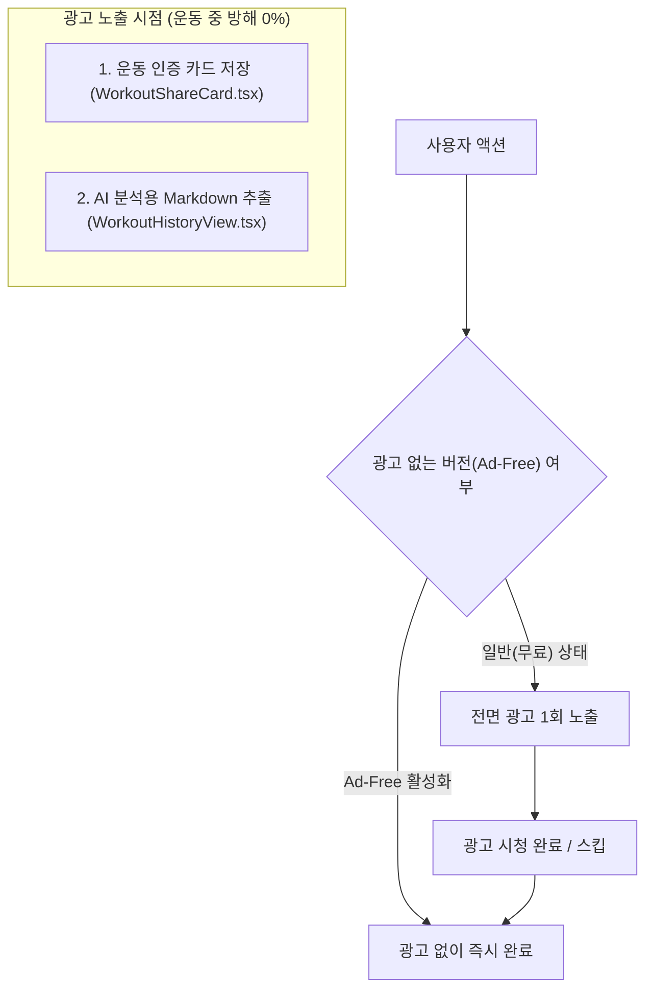

# Iron Muscle 모바일 광고(AdMob) 연동 및 수익화 가이드 (1안)

이 문서는 `feature/ad-integration` 브랜치에 구현된 **1안 (단일 앱 + 광고 제거 인앱 옵션)** 구조와 향후 Google AdMob 및 인앱 결제(IAP)를 연동하는 전체 가이드입니다.

---

## 1. 아키텍처 개요 (현재 구현 상태)

스토어에 무료 앱과 유료 앱을 따로 올리면 심사도 2번 받아야 하고, 무료로 쓰던 사용자의 운동 기록이 유료 앱으로 연동되지 않는 문제가 있습니다.  
따라서 **하나의 앱에서 무료로 쓰되, AI 추출 및 인증샷 저장 시 1회 광고가 노출되고, 추후 '광고 제거'를 켤 수 있는 1안 구조**를 완성했습니다.



### 💡 핵심 원칙: 운동 흐름 절대 방해 금지
- **운동 중(세트 추가, 중량/횟수 입력, 휴식 타이머 등)**에는 **광고가 0개 노출**됩니다.
- 오직 운동이 끝나고 가치 있는 결과물을 획득하는 순간(**인증샷 저장 / AI 마크다운 추출**)에만 전면 광고가 1회 노출됩니다.

---

## 2. 현재 코드 구조 및 테스트 방법

### 구현된 파일
1. **`src/types/settings.ts`**: 사용자 설정 및 `isAdFree` 상태 인터페이스
2. **`src/utils/storage.ts`**: `loadUserSettings()`, `saveUserSettings()`, `isAdFreeUser()` 로컬 영구 저장
3. **`src/services/adService.ts`**: 구글 공식 테스트 광고 ID 및 광고 노출 제어기 (`showInterstitialAd`)
4. **`src/components/common/AdSimulationModal.tsx`**: 네이티브 플러그인 설치 전/웹 환경에서 실제 광고 노출 흐름을 체감할 수 있는 2초 시뮬레이터 모달
5. **`src/components/history/BackupPanel.tsx`**: 하단에 **[⭐ 광고 없는 버전 (Ad-Free) ON/OFF]** 스위치 및 개인정보처리방침 링크 제공
6. **`public/privacy.html` & `PRIVACY_POLICY.md`**: 스토어 심사 통과용 개인정보처리방침 (로컬 저장 & AdMob 식별자 수집 고지 완료)

### 지금 바로 테스트해보기
1. 기록 탭(`운동 기록 조회`) 상단 **`AI 분석 추출`** 버튼을 누르면 광고 시뮬레이터가 팝업됩니다.
2. 운동 인증 카드에서 **`이미지 저장 / 공유`** 버튼을 누르면 광고 시뮬레이터가 팝업됩니다.
3. 기록 탭의 `기록 백업 · 복원` 하단에서 **[광고 없는 버전 (Ad-Free)]**을 켜면, 이후로는 광고 없이 즉시 열립니다!

---

## 3. Google AdMob 계정 생성 및 광고 단위 발급

실제 광고 수익을 얻으려면 구글 애드몹에 가입하고 광고 단위를 발급받아야 합니다.

### Step 1. 애드몹 가입
1. [Google AdMob 웹사이트](https://admob.google.com)에 구글 계정으로 로그인합니다.
2. 국가(대한민국), 시간대(서울), 통화(KRW 또는 USD)를 설정하고 가입을 완료합니다.

### Step 2. 앱 등록
1. 사이드바의 **[앱] -> [앱 추가]** 클릭
2. 플랫폼 선택: **Android** (나중에 iOS도 동일하게 추가)
3. 지원되는 앱 스토어에 등록되어 있나요?: 아직 미출시라면 **'아니오'** 선택 (스토어 출시 후 연결)
4. 앱 이름 입력: `Iron Muscle`

### Step 3. 전면 광고 단위 (Interstitial) 생성
1. 등록한 앱 내에서 **[광고 단위] -> [광고 단위 추가]** 클릭
2. 광고 형식: **[전면 광고]** 선택
3. 광고 단위 이름: `IronMuscle_Android_Interstitial` (iOS는 `IronMuscle_iOS_Interstitial`)
4. 완료 시 **광고 단위 ID**가 발급됩니다.
   - 형태: `ca-app-pub-XXXXXXXXXXXXXXXX/YYYYYYYYYY`

---

## 4. ⚠️ 개발 중 주의사항 (구글 계정 영구 정지 방지)

> [!CAUTION]
> 개발 및 디버깅 중에 **실제 광고 단위 ID를 사용하거나 본인 폰에서 광고를 클릭하면 부정 트래픽(Invalid Traffic)으로 애드몹 계정이 영구 정지**됩니다.  
> 반드시 아래의 **구글 공식 테스트 광고 ID**를 사용해 개발을 진행해야 합니다.

### 구글 공식 테스트 전면 광고 단위 ID
| 플랫폼 | 광고 형식 | 테스트 광고 단위 ID (Test Ad Unit ID) |
| :--- | :--- | :--- |
| **Android** | 전면 광고 (Interstitial) | `ca-app-pub-3940256099942544/1033173712` |
| **iOS** | 전면 광고 (Interstitial) | `ca-app-pub-3940256099942544/4411468910` |

이 값은 이미 `src/services/adService.ts`에 세팅되어 있습니다.

---

## 5. Capacitor 네이티브 AdMob 플러그인 설치 절차 (나중에 적용 시)

나중에 실제로 앱에 애드몹 SDK를 얹을 때는 아래 순서대로 진행하시면 됩니다.

### Step 1. 플러그인 설치
```bash
npm install @capacitor-community/admob
npx cap sync
```

### Step 2. Android 네이티브 설정
`android/app/src/main/AndroidManifest.xml`의 `<application>` 태그 내부에 AdMob App ID를 추가합니다:
```xml
<manifest ...>
    <application ...>
        <!-- AdMob App ID (구글 애드몹 앱 설정에서 확인 가능) -->
        <meta-data
            android:name="com.google.android.gms.ads.APPLICATION_ID"
            android:value="ca-app-pub-XXXXXXXXXXXXXXXX~YYYYYYYYYY"/>
    </application>
</manifest>
```

### Step 3. iOS 네이티브 설정
`ios/App/App/Info.plist`에 AdMob App ID와 추적 권한 문구를 추가합니다:
```xml
<key>GADApplicationIdentifier</key>
<string>ca-app-pub-XXXXXXXXXXXXXXXX~YYYYYYYYYY</string>

<!-- iOS 14.5+ 사용자 추적 권한 설명 (스토어 필수) -->
<key>NSUserTrackingUsageDescription</key>
<string>맞춤형 운동 혜택 및 광고를 제공하기 위해 권한을 사용합니다.</string>

<key>SKAdNetworkItems</key>
<array>
  <dict>
    <key>SKAdNetworkIdentifier</key>
    <string>cstr6suwn9.skadnetwork</string>
  </dict>
</array>
```

### Step 4. `adService.ts`에 네이티브 호출 연결
`src/services/adService.ts`에서:
```ts
import { AdMob, AdOptions } from '@capacitor-community/admob';
import { Capacitor } from '@capacitor/core';

// initialize() 시점:
if (Capacitor.isNativePlatform()) {
  await AdMob.initialize({
    requestTrackingAuthorization: true, // iOS ATT 동의 팝업
  });
}

// showInterstitialAd() 시점:
if (Capacitor.isNativePlatform()) {
  const isAndroid = Capacitor.getPlatform() === 'android';
  const adId = isAndroid ? ADMOB_CONFIG.testInterstitial.android : ADMOB_CONFIG.testInterstitial.ios;
  await AdMob.prepareInterstitial({ adId });
  await AdMob.showInterstitial();
  return true;
}
```

---

## 6. 향후 인앱 결제(IAP: 유료 광고 제거) 연동 가이드

사용자가 1회 결제(예: 2,900원 영구 소장)로 광고를 영구 제거할 수 있도록 하려면 **RevenueCat**을 사용하는 것이 가장 간단합니다.

- **라이브러리**: `@revenuecat/purchases-capacitor`
- **구글/애플 결제 통합**: 구글 플레이 인앱 상품 ID와 애플 앱스토어 인앱 상품 ID를 동일하게 설정(`ad_free_lifetime`)
- **결제 성공 콜백**:
  ```ts
  import { Purchases } from '@revenuecat/purchases-capacitor';
  import { adService } from '../services/adService';

  // 결제 완료 시:
  adService.setAdFree(true);
  ```
- 결제 즉시 `adService.setAdFree(true)`가 호출되어 `iron_user_settings_v1`에 저장되며, 이후 모든 광고 노출이 완전히 비활성화됩니다.

---

## 7. 스토어 심사 체크리스트

1. **개인정보처리방침 URL**:
   - 구글 플레이 콘솔 및 앱스토어 커넥트에 `https://iamminseongKim.github.io/iron-muscle/privacy.html` (또는 배포된 웹 URL) 등록
2. **구글 플레이 콘솔 '앱 콘텐츠' 설문**:
   - [광고] 항목: "예, 제 앱에 광고가 포함되어 있습니다" 체크
   - [데이터 보안] 항목: 수집 데이터 없음 (AdMob 기본 식별자만 포함 체크)
3. **애플 앱스토어 '앱 개인정보 보호'**:
   - 타사 광고 목적으로 기기 ID(IDFA) 수집 체크
